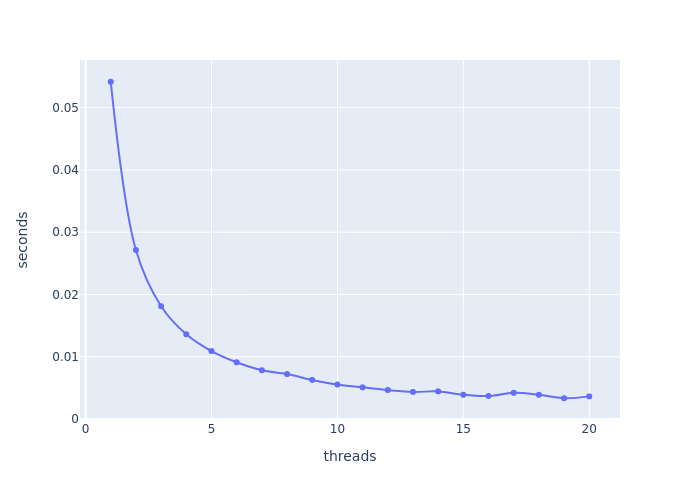
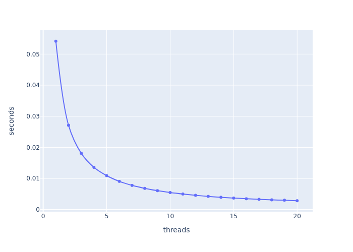

# Rust VS Go Performance test

We use the pi calculation problem 

## Implementation

Both languages supports CSP so we will use channels to communicate between the threads/coroutines.

### Go

```go
package main

import (
	"fmt"
	"runtime"
	"time"
)

const PI25DT float64 = 3.141592653589793238462643
const INTERVALS int = 10000000

func main() {
	cpus := runtime.NumCPU()
	for i := 1; i <= cpus; i++ {
		for j := 0; j < 20; j++ {
			fmt.Println(run(i))
		}
	}
}

func run(cpus int) string {
	var (
		time1     = time.Now()
		ch        = make(chan float64)
		intervals = INTERVALS / cpus
		dx        = 1.0 / float64(INTERVALS)
	)

	for i := 1; i <= cpus; i++ {
		go func(cpu int) {
			var (
				innerSum float64
				x        float64
				end      = intervals * cpu
				start    = end - intervals
			)
			for j := start; j <= end; j++ {
				x = dx * (float64(j) - 0.5)
				innerSum += 4.0 / (1.0 + x*x)
			}
			ch <- innerSum
		}(i)
	}

	var sum float64

	for i := cpus; i > 0; i-- {
		sum += <-ch
	}

	var (
		pi    = dx * sum
		time2 = time.Since(time1).Seconds()
	)

	return fmt.Sprintf("%d, %.24f, %.24f, %.24f", cpus, pi, PI25DT-pi, time2)
}
```

### Rust 

```rust
use std::sync::mpsc;
use std::thread;
use std::time::Instant;

const PI25DT : f64 = 3.141592653589793238462643_f64;
const INTERVALS : i64 = 10000000;

fn main() {
    let cpus = num_cpus::get() as i64;
    for cpu in 1..= cpus{
        for _ in 0..20 {
            let x = run(cpu);
            println!("{x}");
        }
    }
}

fn run(cpus: i64) -> String {
    let time1 = Instant::now();
    let (tx, rx) = mpsc::channel();

    let intervals = INTERVALS / cpus;
    let dx = 1.0 / INTERVALS as f64;

    for cpu in 1 ..= cpus  {
        let thread_tx = tx.clone();

        thread::spawn(move || {
            let mut inner_sum: f64 = 0.0;
            let mut x;

            let end = intervals * cpu;
            let start = end - intervals;


            for j in start ..= end {
                x = dx * (j as f64 - 0.5);
                inner_sum += 4.0 / (1.0 + x*x);
            }

            thread_tx.send(inner_sum).unwrap();
        });
    }

    let mut sum: f64 = 0.0;

    for _ in 1..= cpus {
        sum += rx.recv().unwrap()
    }

    let pi = dx * sum;
    let time2 = time1.elapsed();

    format!("{cpus}, {pi}, {:.24?}, {:.24?}", PI25DT-pi, time2.as_secs_f64())
}
```

## The Results

We got a long CSV output from each program with 20 versions of each amount of cores/threads used.


### Rust

| CPU | Calculated PI      | Error                  | Seconds |
|-----|--------------------|------------------------|---------|
| 1   | 3.1415930535897307 | 3.999999376169683e-07  | 0.0542  |
| 2   | 3.1415933735899357 | 7.200001426177494e-07  | 0.0271  |
| 3   | 3.1415934905128426 | 8.36923049551963e-07   | 0.0181  |
| 4   | 3.141594006060292  | 1.3524704987055713e-06 | 0.0136  |
| 5   | 3.141594321052887  | 1.6674630938240398e-06 | 0.0109  |
| 6   | 3.14159383576778   | 1.1821779870579974e-06 | 0.00910 |
| 7   | 3.1415943503239285 | 1.6967341354146015e-06 | 0.00783 |
| 8   | 3.1415952647806735 | 2.611190880430492e-06  | 0.00721 |
| 9   | 3.1415953791715485 | 2.7255817553806238e-06 | 0.00627 |
| 10  | 3.141595893515874  | 3.2399260807558505e-06 | 0.00553 |
| 11  | 3.141594207826835  | 1.5542370417342966e-06 | 0.00508 |
| 12  | 3.1415957221125703 | 3.0685227772053736e-06 | 0.00465 |
| 13  | 3.14159483637872   | 2.1827889270076282e-06 | 0.00434 |
| 14  | 3.1415951506296795 | 2.4970398864176957e-06 | 0.00443 |
| 15  | 3.141595464868437  | 2.8112786440992465e-06 | 0.00389 |
| 16  | 3.1415977790965375 | 5.125506744341202e-06  | 0.00369 |
| 17  | 3.1415970933177517 | 4.439727958605033e-06  | 0.00420 |
| 18  | 3.141596407531791  | 3.7539419975640697e-06 | 0.00388 |
| 19  | 3.1415957217397055 | 3.068149912466289e-06  | 0.00333 |
| 20  | 3.141599035941979  | 6.382352185951845e-06  | 0.00363 |



### Go

| CPU | Calculated PI      | Error                  | Seconds |
|-----|--------------------|------------------------|---------|
| 1   | 3.1415930535897307 | 3.999999376169683e-07  | 0.05414 |
| 2   | 3.1415933735899357 | 7.200001426177494e-07  | 0.02711 |
| 3   | 3.141593490512843  | 8.369230497962121e-07  | 0.01812 |
| 4   | 3.141594006060292  | 1.3524704987055713e-06 | 0.01359 |
| 5   | 3.141594321052887  | 1.667463093979471e-06  | 0.01092 |
| 6   | 3.1415938357677806 | 1.1821779874132688e-06 | 0.00909 |
| 7   | 3.141594350323929  | 1.696734135681055e-06  | 0.00780 |
| 8   | 3.1415952647806735 | 2.6111908803194695e-06 | 0.00683 |
| 9   | 3.1415953791715485 | 2.725581755225193e-06  | 0.00609 |
| 10  | 3.141595893515874  | 3.2399260809556906e-06 | 0.00550 |
| 11  | 3.1415942078268353 | 1.5542370419563412e-06 | 0.00502 |
| 12  | 3.14159572211257   | 3.0685227768945112e-06 | 0.00461 |
| 13  | 3.1415948363787205 | 2.182788927185264e-06  | 0.00426 |
| 14  | 3.1415951506296795 | 2.497039886484309e-06  | 0.00397 |
| 15  | 3.1415954648684377 | 2.8112786443657002e-06 | 0.00371 |
| 16  | 3.1415977790965375 | 5.125506744252384e-06  | 0.00349 |
| 17  | 3.1415970933177517 | 4.439727958804874e-06  | 0.00331 |
| 18  | 3.141596407531791  | 3.7539419976972965e-06 | 0.00314 |
| 19  | 3.1415957217397055 | 3.0681499123330624e-06 | 0.00303 |
| 20  | 3.1415990359419785 | 6.3823521856187785e-06 | 0.00287 |



## Conclusion

We can see that Go in average is a little bit faster than Rust but they are both very close
